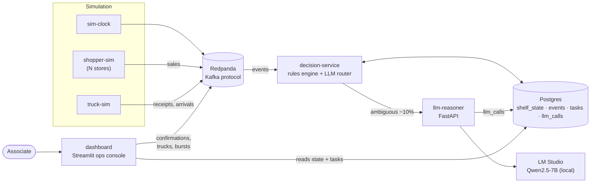
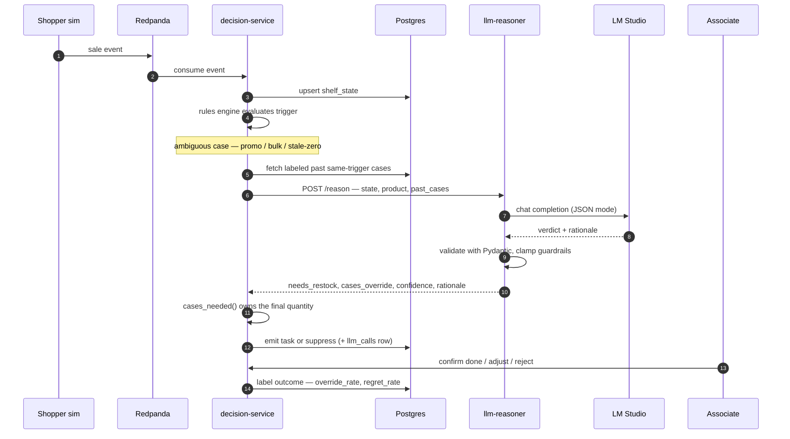
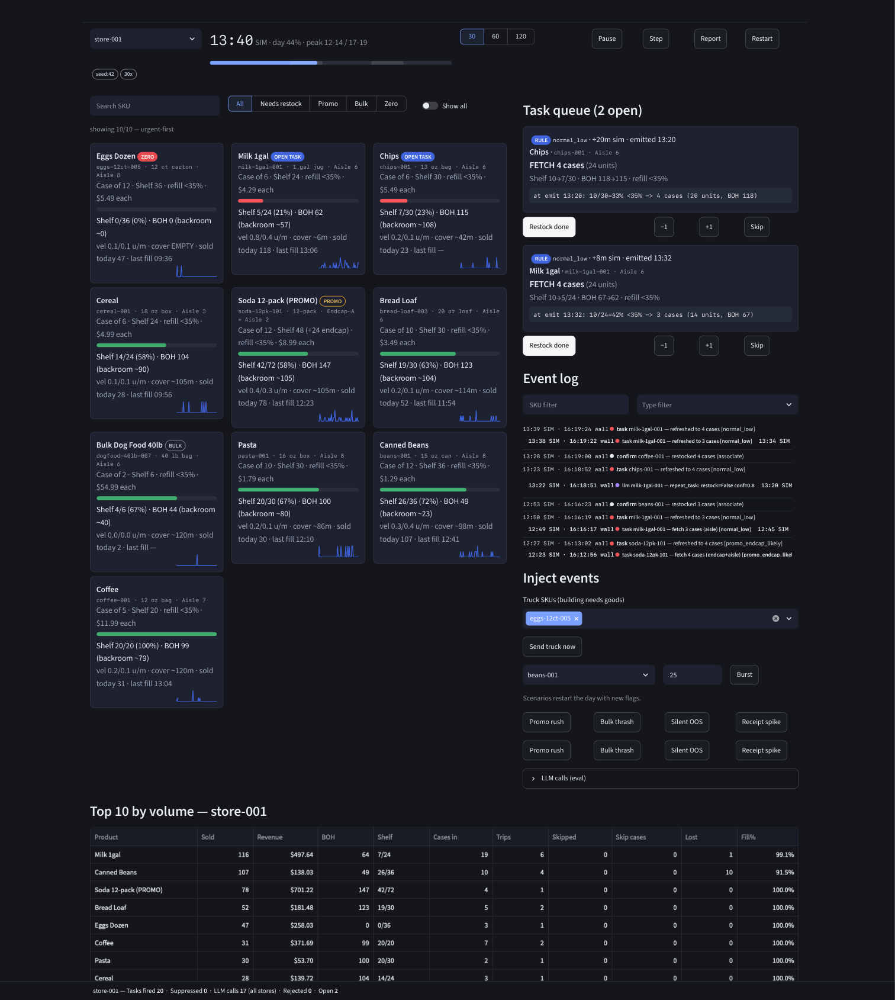

# Shelf Replenishment POC — LLM in the Mix

[](https://github.com/gjmoyer/replenishment_poc/actions/workflows/ci.yml)
[](https://github.com/gjmoyer/replenishment_poc/actions/workflows/codeql.yml)
[](#engineering-practices)
[](https://www.python.org/)
[](https://github.com/astral-sh/ruff)
[](LICENSE)

A working prototype that watches real-time grocery sales and decides what needs
restocking on the shelves — with a small **local** LLM reasoning over the
ambiguous cases that pure rules get wrong.

Deterministic rules handle ~90% of decisions (fast, exact, cheap). An LLM
handles the ~10% exceptions: promo items with endcap stock, bulk items that
thrash naive thresholds, silent out-of-stocks only a truck delivery can rescue.
Every LLM verdict passes back through the rules calculator, so the model can
advise and explain but **never invent quantities**.

> Built as a learning vehicle for LLM-in-the-loop retail ops: real streaming
> transport, a real state store, an event-driven decision service, a live ops
> console, and a local model in the loop — all runnable on one laptop.

## By the numbers

One deterministic simulated day (seed 42, 07:00–22:00, 60x speedup), replayed
end-to-end in CI on every push:

| Metric | Result |
|--------|--------|
| Units sold | **1,150** |
| Restock tasks fired | **47** (46 completed, **0 abandoned**, 0 left open) |
| Decisions suppressed by guardrails | **201** |
| — promo false-positives avoided (endcap still stocked) | 165 |
| — bulk re-tasks debounced | 25 |
| — backroom-constrained | 7 |
| — truck not needed | 4 |
| Test suite | **120 tests**, 76% coverage (decision logic 90%+) |
| Static analysis | `ruff` clean · `mypy` clean (32 files) |

The interesting result is the **201 suppressed decisions**: a naive
threshold-only system fires a task every time a shelf dips, while this one
reasons about endcap stock, backroom reality, and re-task thrash before
interrupting an associate. The LLM sits only on the residual ambiguity, so the
fast path stays exact.

## How it works



- **Simulated stores** publish every sale, backroom receipt, and truck arrival
  to Kafka. A full 07:00–22:00 day plays in ~15 minutes at 60x.
- **Decision service** tracks estimated shelf quantity per item (shelves start
  full at opening), fires restock tasks with exact case counts, and routes only
  ambiguous cases to the LLM with a strict JSON contract.
- **Dashboard** shows per-store shelf levels, the task queue with rule-formula
  or LLM rationales, and lets you play the associate: restock, adjust, skip,
  dispatch trucks, force sale bursts, run scenarios.
- **LLM reasoner** is a FastAPI service in front of a local model (LM Studio,
  Apple-Silicon MLX). Async, cached, timeout-guarded — it can never block the
  rules fast path.

### The LLM exception path

Rules fire most tasks directly. Only ambiguous cases reach the model, and its
answer is advisory: `cases_needed()` still computes the final quantity.



## Quickstart

Prerequisites: Docker Desktop, [`uv`](https://docs.astral.sh/uv/), and
[LM Studio](https://lmstudio.ai) with `Qwen2.5-7B-Instruct-MLX-4bit` loaded and
its server on `:8081`.

Build the stack locally:

```bash
make up            # build Redpanda + Postgres 18 + all services, then start
# open http://localhost:8501/ — press Restart, then Play
make replay        # headless deterministic day (seed 42) + acceptance checks
make test          # unit + regression suite
make down          # stop everything
```

Prefer not to build? The release pipeline publishes the app image to GHCR on
every `v*` tag, and Compose is wired to use it:

```bash
make up-image                 # pull ghcr.io/gjmoyer/replenishment_poc:latest, then up
POC_TAG=0.1.1 make up-image   # or pin a specific release
```

Five-minute tour: Restart → Play at 60x → watch morning depletion → Restock a
task → at ~13:00 eggs silently empties → 14:00 truck arrives → `VERIFY DOCK` →
receipt lands → restock task. That scene is the thesis. Full operator
instructions: [`doc/08-dashboard-guide.md`](doc/08-dashboard-guide.md).

No Docker? The whole rules engine + simulation runs headless with
`make replay` (no Kafka, no Postgres, no LLM required).

## Engineering practices

This repo is wired like a small production service, not a notebook:

- **CI** (`.github/workflows/ci.yml`) — ruff lint + format check, mypy, and the
  full test suite on Python **3.12 and 3.13**, plus a headless replay
  acceptance run, on every push and PR.
- **Tests** — 120 unit/regression/contract tests (`pytest`), with a **70%
  coverage gate** enforced in CI. The pure decision core (rules, state,
  feedback, history, schemas, scenarios) sits at 97–100%.
- **Type checking** — `mypy` clean across all 32 source files.
- **Pre-commit** — ruff, mypy, and hygiene hooks pinned to the same toolchain
  CI uses (`uv.lock`), so local and CI never disagree.
- **Releases** (`.github/workflows/release.yml`) — pushing a `v*` tag builds a
  wheel + sdist, publishes a GitHub Release with auto-generated notes, and
  pushes a **multi-arch** (`amd64` + `arm64`) container image to GHCR.
- **Security** — CodeQL `security-and-quality` scanning on push, PR, and a
  weekly schedule; Dependabot keeps pip, Actions, and Docker images current.
- **Reproducibility** — `uv.lock` committed; `make ci` runs exactly what
  Actions runs; the simulation is seeded and asserted.

## Repo layout

```
core/       single config source (config/poc.yaml + env)
sim/        demand publishers, truck sim, headless day loop, live runner
decision/   rules engine, LLM router, Kafka↔Postgres service
llm/        FastAPI reasoner + hardened prompt + schemas
dashboard/  Streamlit ops console (dark theme)
infra/      docker-compose.yml, Dockerfile, Postgres schema
tests/      rules (49) + sim acceptance + LLM contract tests
doc/        split design docs, one topic each (see doc/README.md)
```

Python throughout (`uv` managed), one shared Postgres, Kafka-protocol transport
(Redpanda locally, swappable for real Kafka with one env var).

## Docs

Start with [`doc/00-overview.md`](doc/00-overview.md), then whatever your task
needs — each file is self-contained and sized for AI consumption:

| File | Covers |
|------|--------|
| `01-data-contracts.md` | Kafka topics, JSON schemas, product/store master |
| `02-rules-engine.md` | Shelf tracking, restock math, promo/bulk/truck rules |
| `03-simulation-publishers.md` | Shoppers, trucks, speedup, scenarios |
| `04-llm-reasoner.md` | Exception triggers, prompt, guardrails |
| `05-dashboard-associate.md` | UI spec |
| `06-architecture-techstack.md` | Services, Compose, run modes |
| `07-milestones-acceptance.md` | Build status, demo script |
| `08-dashboard-guide.md` | How to operate the monitor |
| `09-simulation-realism.md` | Real-vs-invented calibration status, retune worksheet |
| `10-session-log.md` | Session decisions, incidents, handoff notes |
| `11-future-work.md` | Session learnings + prioritized improvement ideas |
| `12-scalability.md` | 2,000-store × 10K-SKU evaluation, bottlenecks, pilot vs fleet path |

## Status

M1–M6 built and demo-verified live: rule tasks, LLM exception tasks, manual
restock/adjust/skip, truck rescue flow, scenarios, day-end summary, PG-backed
exactly-once processing and restart resume. See `07` for details.

MIT licensed.

## Dashboard



Mid-day at the Downtown store — milk running hot with an open fetch task, eggs
silently empty awaiting the 14:00 truck rescue, the event log showing an LLM
`repeat_task` review, and per-product fill rates in the Top 10 table.
